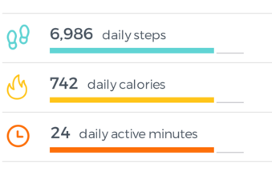

# ProgressViews
[](https://jitpack.io/#apollo29/ProgressViews)

This repository started as a personal usage of [Zeki Guler](https://github.com/zekapp) Android-ProgressViews library. You can check his work [here](https://github.com/zekapp/Android-ProgressViews).




## Download

#### Gradle:

```groovy
dependencies {
    implementation 'com.github.apollo29:ProgressViews:1.0.0'
}
```
```
allprojects {
    repositories {
            ...
            maven { url "https://jitpack.io" }
        }
    }
```

## Usage
    
### ProgressWheel

```xml
   <com.apollo29.progressviews.ProgressWheel
        android:id="@+id/wheelprogress"
        android:layout_width="150dp"
        android:layout_height="150dp"
        app:barWidth="17dp"
        app:marginBtwText= "15dp"
        app:countText="931,199"
        app:definitionText="Steps"
        app:countTextColor="@android:color/black"
        app:defTextColor="@android:color/black"
        app:progressColor="@color/colorAccent"
        app:defTextSize="10sp"
        app:countTextSize="20sp"
        app:percentage="90" />
```
            
### ProgressLine

```xml
    <com.apollo29.progressviews.ProgressLine
        android:id="@+id/progress_line"
        android:layout_width="0dp"
        android:layout_height="match_parent"
        android:layout_weight="0.9"
        app:definition="daily steps"
        app:value="10,000"
        app:lineBarWidth="7dp"
        app:valuePercentage="55"
        app:valueDefTextSize="20sp"
        app:lineProgressColor="@color/colorAccent"
        app:underLineColor="@android:color/darker_gray" />
```

<a href='https://ko-fi.com/H2H32EWM1' target='_blank'></a>

## License

	MIT License

	Copyright (c) 2021 Thomas D'Ascoli

	Permission is hereby granted, free of charge, to any person obtaining a 
	copy of this software and associated documentation files (the "Software"), 
	to deal in the Software without restriction, including without limitation 
	the rights to use, copy, modify, merge, publish, distribute, sublicense, 
	and/or sell copies of the Software, and to permit persons to whom the 
	Software is furnished to do so, subject to the following conditions:

	The above copyright notice and this permission notice shall be included 
	in all copies or substantial portions of the Software.

	THE SOFTWARE IS PROVIDED "AS IS", WITHOUT WARRANTY OF ANY KIND, EXPRESS
	OR IMPLIED, INCLUDING BUT NOT LIMITED TO THE WARRANTIES OF MERCHANTABILITY,
	FITNESS FOR A PARTICULAR PURPOSE AND NONINFRINGEMENT. IN NO EVENT SHALL
	THE AUTHORS OR COPYRIGHT HOLDERS BE LIABLE FOR ANY CLAIM, DAMAGES OR OTHER
	LIABILITY, WHETHER IN AN ACTION OF CONTRACT, TORT OR OTHERWISE, ARISING 
	FROM, OUT OF OR IN CONNECTION WITH THE SOFTWARE OR THE USE OR 
	OTHER DEALINGS IN THE SOFTWARE.